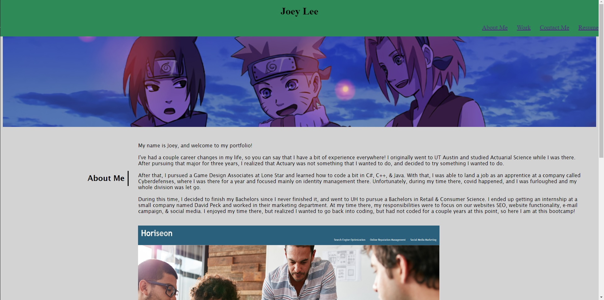
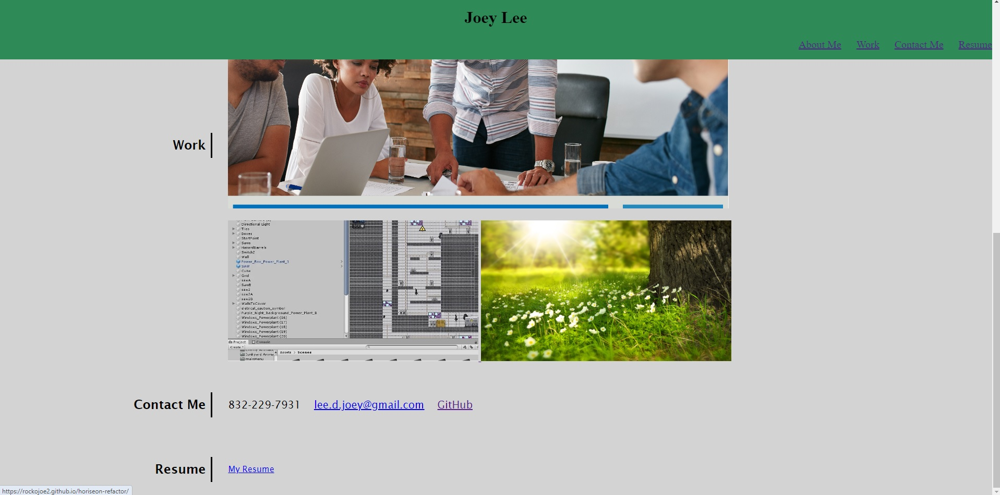
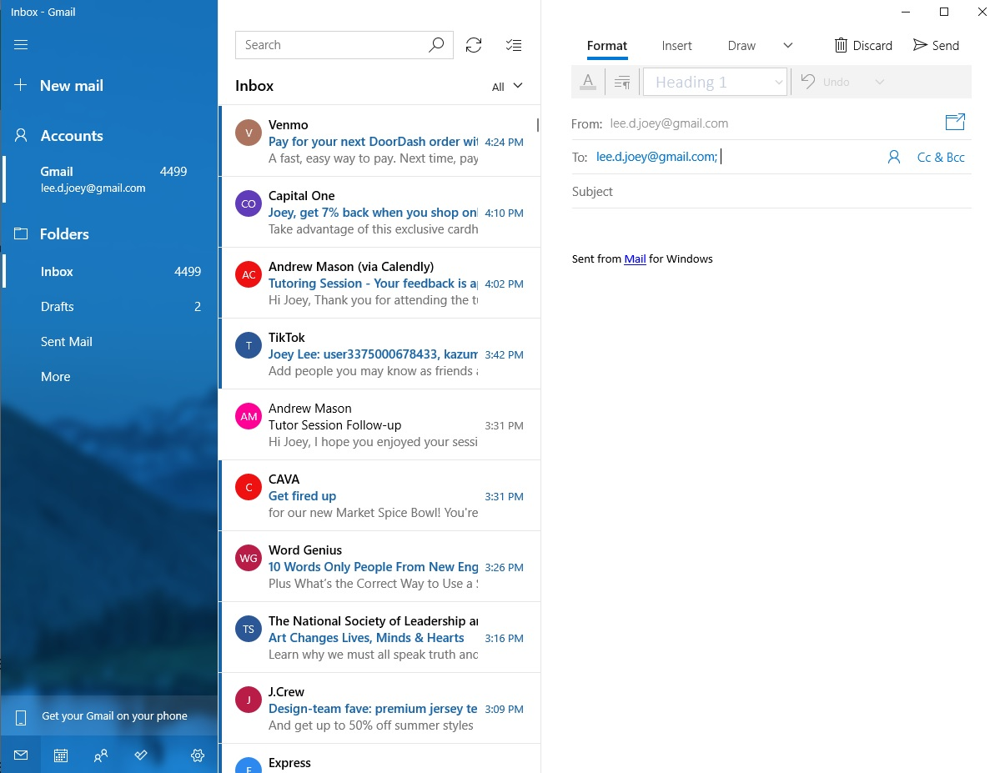

# my-portfolio

## Description

The goal of this project was to create a website from scratch in order to put together all that I've learned so far in .html and .css into a singular project. What I created was a simple portfolio page.  

The website has a fixed header with my name, and four navigation links on the header. When you click the navigation links, it will bring you to the area on the website that corresponds with the navigation link. (Clicking on "About Me" will take you to the "About Me" section, clicking on "Work" will take you to the "Work" section, etc.)

Below the header is a banner image, and below the banner image is where my personal information is. All sections to the right of the headings should have a consistent starting point. Under the work section, the first image is bigger than the bottom two images, and if you highlight over the images, the image opacity is lowered to give it a highlight effect. Clicking on the first two images will take you to that project. 

The "Contact Me" section has my phone number, e-mail, and link to my GitHub. If you click the e-mail, your e-mail should pop up with a new message ready to send an e-mail to me.

The Resume when clicked should download my resume in a word doc to your PC.

## Installation

N/A

## Usage

## Credits

https://css-tricks.com/snippets/css/a-guide-to-flexbox/#aa-flexbox-properties
https://www.w3schools.com/html/html5_semantic_elements.asp
UTA-VIRT-FSF-FT-06-2023-U-LOLC Repo in GitLab.

## License

MIT License

---

